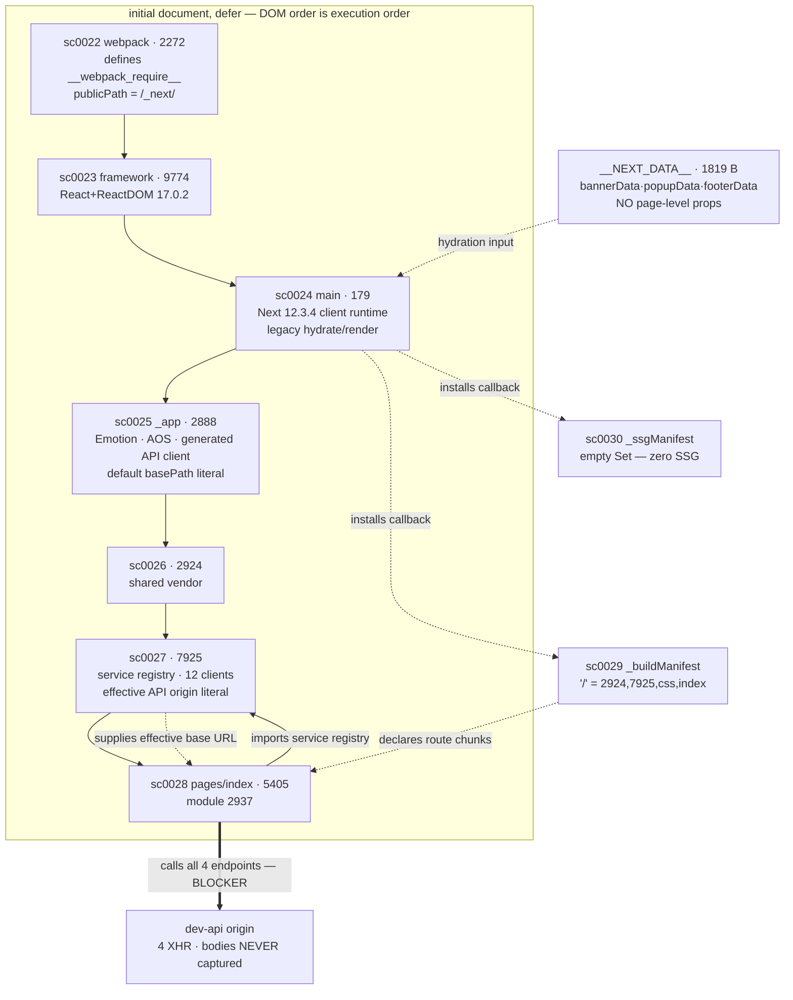

# 02 — JS dependency graph

Evidence base: Phase 1 run `2026-09-16T05-27-10-722Z` (desktop canonical, mobile
cross-checked). Nothing here was executed; every claim is static or network-manifest
evidence. Offsets are byte offsets into the Phase 1 script bodies.

## Stack recognition

| Fact | Value | Evidence | Confidence |
|---|---|---|---|
| Bundler | **webpack 5** | `sc0022:~4500` `self.webpackChunk_N_E` push protocol (webpack 5; not the webpack 4 `webpackJsonp` array) | HIGH |
| Framework | **Next.js 12.3.4, Pages Router** | `sc0024:13983` `t.version="12.3.4",t.router=p`; `window.__NEXT_P` at `sc0028:~60` | HIGH |
| View layer | **React / ReactDOM 17.0.2** | `sc0023:116598`, `:118580`, `:125456` | HIGH |
| Render root | **legacy**, not React 18 concurrent root | `sc0024:20658` `ee?(L.hydrate(n,e),ee=!1):L.render(n,e)`; zero hits for `react-dom/client`, `createRoot`, `hydrateRoot` | HIGH |
| CSS-in-JS | **Emotion ≥11.9** (not styled-components) | `sc0025:822` `setAttribute("data-emotion",…)`; `sc0025:14536` `__emotion_styles`; `sc0025:23161` `useInsertionEffect` shim | HIGH |
| Rendering mode | **SSR everywhere, zero SSG** | `_ssgManifest` = `self.__SSG_MANIFEST=new Set` (empty); `__NEXT_DATA__.gssp=true`, `__N_SSP=true` | HIGH |

## publicPath — **not** origin-bound

`sc0022:4080` → `r.p="/_next/"`

A hard-coded **root-relative literal**. It is not derived from
`document.currentScript.src`, and `__NEXT_DATA__` carries no `assetPrefix` key. This
is the single most favourable finding for replay: chunk loading needs no source
origin.

The one constraint it imposes: the replay must be served from a **server root**.
`/_next/` resolves from the origin root, so hosting the clone in a subdirectory or
opening it over `file://` breaks chunk resolution.

**That constraint is not met today** *(corrected after independent review, M1)*. The
Phase 2 preview server (`src/preservation-clone/serve.ts`) serves the variants at
`/desktop/` and `/mobile/` — subdirectories — and sends
`content-security-policy: script-src 'none'` on every response. Both are correct for
Phase 2, whose whole point is that nothing executes. Both must change for any Phase 3B
replay.

## Required initial load order

All bundles carry `defer`, so DOM order is the execution order. Each step below is
corroborated twice — by DOM offset in `document/response.html` and by webpack's own
`e.O(0,[…])` dependency gate emitted at the tail of each chunk.

| # | id | file | webpack chunk id | why it must come here | conf |
|---|---|---|---|---|---|
| — | sc0021 | `polyfills-*.js` | — | `nomodule` (`response.html:28416`) — a module-capable browser never fetches or runs it | HIGH |
| 1 | sc0022 | `webpack-*.js` | 2272 | defines `__webpack_require__` and replaces `.push` on the chunk array; nothing else can register without it | HIGH |
| 2 | sc0023 | `framework-*.js` | 9774 | React/ReactDOM | HIGH |
| 3 | sc0024 | `main-*.js` | 179 | Next client runtime; installs the `__BUILD_MANIFEST_CB` / `__SSG_MANIFEST_CB` callbacks | HIGH |
| 4 | sc0025 | `pages/_app-*.js` | 2888 | app shell, Emotion, API client | HIGH |
| 5 | sc0026 | `2924-*.js` | 2924 | shared vendor chunk | HIGH |
| 6 | sc0027 | `7925-*.js` | 7925 | shared vendor chunk | HIGH |
| 7 | sc0028 | `pages/index-*.js` | 5405 | homepage page chunk; tail gate `e.O(0,[2924,7925,9774,2888,179],…)` names every predecessor | HIGH |
| 8 | sc0029 | `_buildManifest.js` | — | callback installed by chunk 179, so must follow sc0024 — but not otherwise ordered | MEDIUM |
| 9 | sc0030 | `_ssgManifest.js` | — | same constraint as sc0029 | MEDIUM |

Page module resolution for `/`: `sc0028:~60`
`(window.__NEXT_P=…).push(["/",function(){return i(2937)}])` → registrar module
**8312**, page component module **2937**, inside chunk 5405. HIGH.

## Homepage chunk set is complete

`_buildManifest` maps `"/"` → `[2924, 7925, css/d7c08271dabb56dd, pages/index]`.
Every one of those is captured, as are webpack / framework / main / `_app` and the
`_app`-level CSS chunk `80139ea3111436a9`.

**No chunk required by the homepage is missing from the Phase 1 capture.**

**No dynamic chunk loading exists on this page.** `__webpack_require__.e(` call sites
across sc0024/25/26/27/28 = **0**; no `next/dynamic`, no `loadableGenerated`;
`dynamicIds` absent from `__NEXT_DATA__`. The webpack runtime's 13-entry
`reactPlayer*` `r.u` table is build-wide, unreferenced by the homepage, and
uncaptured — correctly so, since it is never reached.

## What *is* missing, and why it matters later

`_buildManifest` describes **33 routes**. The other 32 page chunks and the shared
chunks 3824 / 6310 / 7579 were never captured — Phase 1 captured one page load, and
this page loads none of them. Consequence: under a JS-enabled replay, a client-side
`<Link>` navigation would request a chunk that does not exist and 404. That is a
route-scope limit, not a defect in this capture.

## Graph

Solid arrows are evidenced load/execution edges. Dotted arrows are data/callback
relationships. The thick arrows are the unresolvable ones: see `04-source-bound-and-api.md`.

## Honest summary

**The code graph is complete and internally consistent. The data graph is not.**

Every byte of JavaScript this page needed to boot is on disk, in a known order, with
a non-origin-bound publicPath and no dynamic chunk resolution to satisfy. What is
absent is the content those bundles fetch at runtime.
